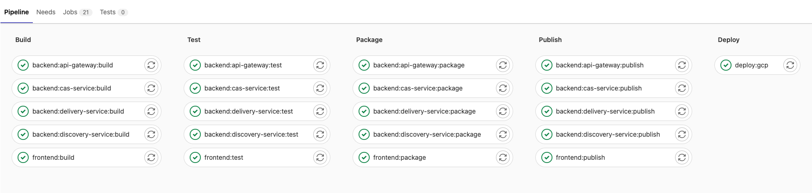
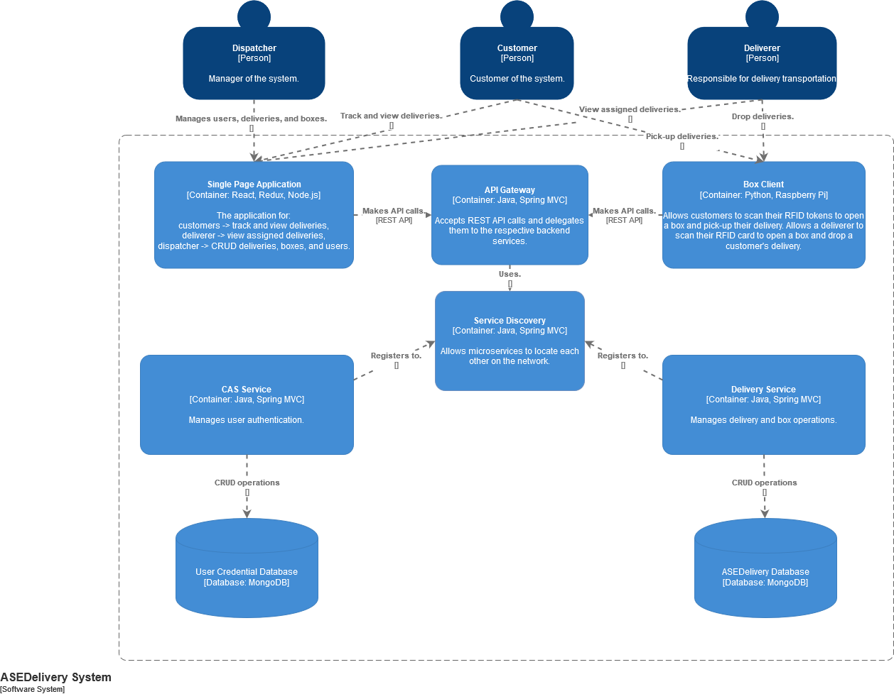

# Advanced Topics of Software Engineering (WS2021/22)- Group 4

[](https://github.com/tterb/atomic-design-ui/blob/master/LICENSEs)

#### Table of Contents
- [1 Requirements](#1-requirements)
- [2 Security](#2-security)
    - [JWT HttpOnlyCookie](#jwt-httponlycookie)
    - [CRSF Protection](#crsf-protection )
- [3 Deployment](#3-deployment)
    - [Login Information](#login-information)
    - [Continuous Deployment on Google Cloud Platform](#continuous-deployment-on-google-cloud-platform)
    - [Local docker-compose setup](#local-docker-compose-setup)
- [4 Local Development Setup](#4-local-development-setup)
  - [Repository](#repository)
  - [React Application](#react-application)
  - [Spring Microservice Architecture](#spring-microservice-architecture)
  - [URLs](#urls)
- [5 Tech Stack](#5-tech-stack)
- [6 Authors](#6-authors)
- [7 License](#7-license)

    
## 1 Requirements
This project was developed with the following versions:

- Maven 3.8.3
- Java 17.0.1
- ReactJS 17.0.2
- NodeJS 16.13.0
- npm 8.1.0

## 2 Security
### JWT HttpOnlyCookie
After a successful login a httpOnly Cookie gets generated which contains a jwt token that authenticates and authorizes 
every request made afterwards.

### CRSF Protection 
Every Type of CRUD Operation except GET is protected by CRSF.
With every request first a CSRF token has to be requested and sent with the modifying request. 
This works automatically.

## 3 Deployment
### Login Information
This application provides no signup-functionality, since only the dispatcher can do CRUD-Operations on Users.
The dispatcher, who acts like an admin in the system, and the deliverer and customer have the following credentials:

| Username | Password
| :-------- | :------- | 
| `dispatcher` | `123456` |
| `deliverer` | `123456` |
| `customer` | `123456` |

### Continuous Deployment on Google Cloud Platform
The project is continuously deployed to a Virtual Machine in Google Cloud Platform. The frontend is available on the URL: http://34.159.69.43:3000/.

The CI/CD pipeline is triggered only if there was a change in the relevant source code directory. The docker images are stored in the GitLab Container Registry. The jobs are executed by a shared runner (must be online) or specific runners.


### Local docker-compose setup
Clone the project

```bash
  git clone https://gitlab.lrz.de/ase-21-22/team-4/ase-group4.git
```

Adjust the api-url to "localhost" in frontend: modify in file `frontend/src/api_url.js` the line to `export const api_url = "http://localhost:8080";`.

Build target folders for each microservice:
```bash
  cd <microservice-path>
  mvn package
```

Start all services in Docker Containers:
```bash
  docker-compose up
```
Access URLs for the project are defined in section [Local Development Setup > URLs](#urls). To launch multiple instances of backend microservices the `--scale SERVICE=NUM` option of `docker-compose up` can be used. For this the port ranges should be defined in a wider range in the docker-compose.yml like we did with the cas-service as an example to scale.

## 4 Local Development Setup
### Repository

Clone the project

```bash
  git clone https://gitlab.lrz.de/ase-21-22/team-4/ase-group4.git
```

### React Application
Adjust the api-url to "localhost" in frontend: modify in file `frontend/src/api_url.js` the line to `export const api_url = "http://localhost:8080";`.

Install Dependencies for Frontend and Start

```bash
  cd frontend
  npm install
  npm start
```

### Spring Microservice Architecture
This is an overview of the microservice realized for this project:




As you can see the backend consists of
- API Gateway (Single Point of Entry for every request (Spring Cloud Gateway))
- Service Discovery (Eureka Server which registers every service)
- CAS Service (Eureka Client that registers to Service Discovery)
- Delivery Service (Eureka Client that registers to Service Discovery)

Every Service has to be started individually.

Start Spring Boot Application

```bash
  cd <microservice-path>
  mvn spring-boot::run
```

### URLs
- Frontend URL: [localhost:3000](http://www.localhost:3000)
- Eureka Server (Discovery Service): [localhost:8761](http://www.localhost:8761)
- API Cloud Gateway: [localhost:8080](http://www.localhost:8080)
- CAS Swagger API Doc: [localhost:8081/swagger-ui.html](http://localhost:8081/swagger-ui.html)
- Delivery Swagger API Doc: [localhost:8082/swagger-ui.html](http://localhost:8082/swagger-ui.html)


## 5 Tech Stack

**Client:** React, Redux, MaterialUI, ReactSuite

**Server:** Spring Boot, MongoDB, Spring Cloud Gateway, Spring Netflix Eureka


## 6 Authors

- [Taha Obed [Github]](https://github.com/tobed1995)
- [Milena Zahn [Github]](https://github.com/mlnzhn)
- [Umer Zia [Github]](https://github.com/umerf52)
- [Alex Seibicke [Github]](https://github.com/Alex2448)
- [Selina Hochstrat [Github]](https://github.com/Sally-Creator)


## 7 License

[MIT](https://choosealicense.com/licenses/mit/)

